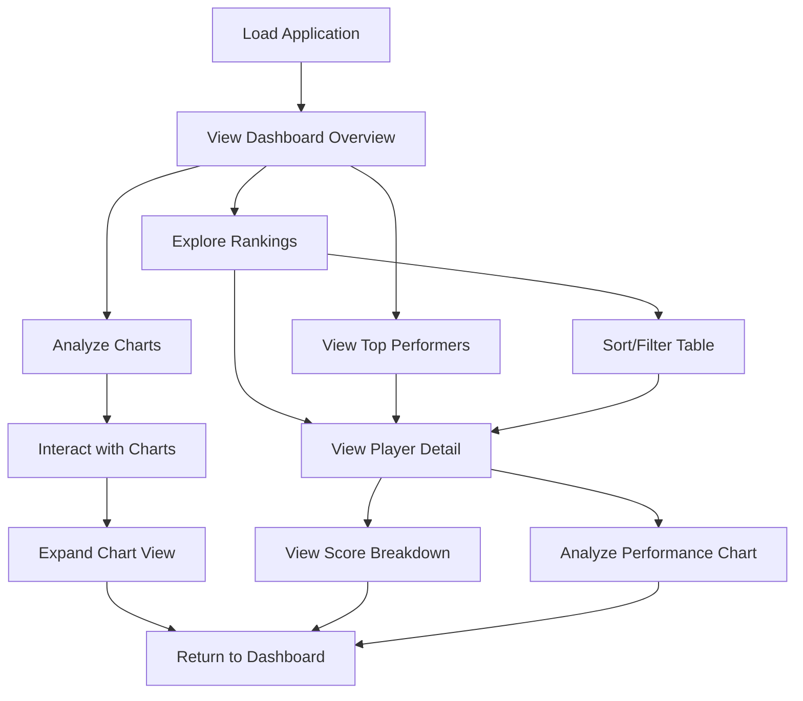

# Product Context

## Why This Project Exists

The ChefScore Analytics Dashboard was created to solve the problem of understanding and analyzing player performance data in the mobile game Chef's Game. In competitive gaming environments, players need tools to:

1. **Visualize Performance**: Transform raw CSV data into meaningful visualizations that highlight trends and patterns
2. **Compare Rankings**: Understand their standing relative to other players
3. **Identify Strengths and Weaknesses**: Analyze performance across different categories
4. **Track Progress**: Monitor changes in performance metrics over time

Without this tool, players would need to manually analyze spreadsheets or build their own visualizations, which is time-consuming and inaccessible to many players.

## Problems It Solves

### 1. Data Accessibility
Raw game data in CSV format is difficult to interpret at scale. ChefScore transforms this raw data into interactive visualizations and sortable tables that make information immediately accessible and actionable.

### 2. Performance Comparison
Players want to understand how they compare to others but lack easy comparison tools. The dashboard provides:
- Ranking tables showing relative position
- Distribution charts showing where a player fits in the overall population
- Category-specific analysis to identify areas of strength and improvement

### 3. Insight Generation
Raw data doesn't automatically yield insights. The dashboard's specialized charts and views help players discover patterns and correlations, such as:
- Which categories contribute most to high scores
- Relationships between different metrics (e.g., score vs. chests collected)
- Common characteristics of top-performing players

### 4. Information Sharing
Game communities need shared reference points for discussion. The dashboard provides:
- Consistent visualization formats for communication
- Ability to explore specific metrics related to discussions
- Language options to support international player groups

## How It Should Work

### Core User Flow

### Key Operational Principles

1. **Data-First Approach**: All features are driven by the underlying data structure, ensuring accurate representation
2. **Progressive Disclosure**: Start with overview, then allow drill-down into specific details
3. **Consistent Interactions**: Maintain consistent UI patterns across all views
4. **Responsive Adaptation**: Adjust layout and functionality based on device capabilities
5. **Language Flexibility**: Support multiple languages without requiring page reload

## User Experience Goals

### 1. Intuitive Navigation
Users should immediately understand how to move between different views and sections of the application without requiring instructions or training.

### 2. Fast Performance
The application should load quickly and respond immediately to user interactions, even with large datasets. Visualizations should render smoothly without noticeable delays.

### 3. Clear Data Presentation
Charts and tables should be immediately interpretable, with clear labeling, appropriate scales, and thoughtful use of color to convey meaning.

### 4. Actionable Insights
Beyond raw data presentation, the application should help users derive meaningful insights about their performance and potential areas for improvement.

### 5. Device Flexibility
Users should have a quality experience regardless of whether they're using a desktop computer, tablet, or mobile phone, with appropriate adaptations for each form factor.

### 6. Accessibility
The application should be usable by players with various accessibility needs, including proper contrast, keyboard navigation, and screen reader support

## Product Evolution

### Architectural Simplification

The ChefScore Analytics Dashboard has evolved to focus exclusively on current player data analysis without week-to-week historical comparison. This architectural change:

1. **Simplifies the User Experience**
   - Removes complexity of week selection and historical comparison
   - Focuses the application on immediate data insights
   - Streamlines the interface for more intuitive navigation

2. **Refines Core Purpose**
   - Emphasizes high-quality analysis of current player performance
   - Delivers clear, actionable insights without historical noise
   - Prioritizes data visualization clarity over temporal comparison

3. **Technical Benefits**
   - Reduces codebase complexity
   - Improves application maintainability
   - Enables faster development of new analytics features

This evolution aligns with user feedback indicating preference for clear, focused analytics over historical comparison functionality 