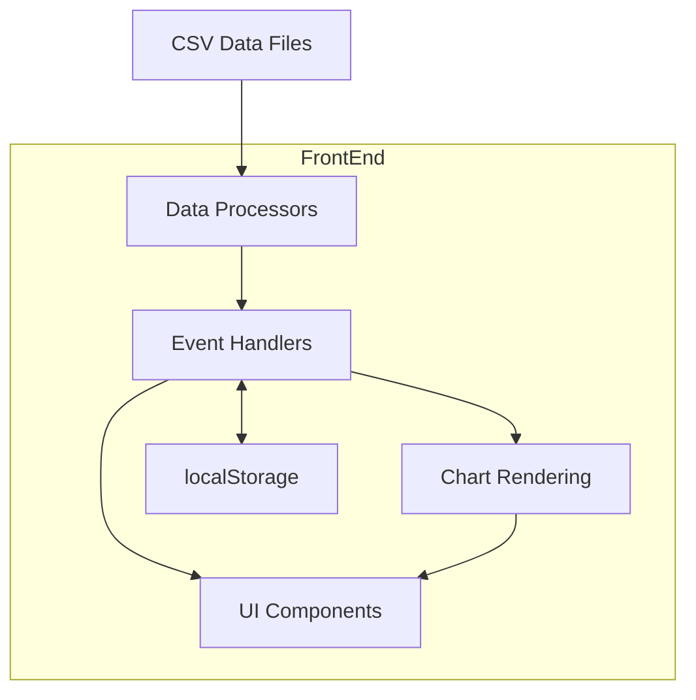

# System Patterns

## System Architecture



The Chest Analyzer follows a client-side single-page application architecture with these key components:

### Data Layer
- **CSV Parser (PapaParse)**: Handles loading and parsing raw CSV data
- **Data Processor**: Cleans and transforms raw data for visualization
- **localStorage**: Stores user preferences (language selection)

### Core Functionality
- **Event Handlers**: Manage user interactions and view transitions
- **DOM Manipulation**: Updates the UI based on user actions and data changes
- **Table Management**: Handles rendering, sorting, and filtering of data tables

### View Layer
- **UI Components**: Dashboard, tables, modals, navigation elements
- **ApexCharts**: Various chart types (donut, bar, scatter, radar)
- **Internationalization**: Language switching functionality

## Key Technical Decisions

### 1. Frontend-Only Architecture
The application runs entirely in the browser without a backend server. This decision was made to:
- Eliminate server dependencies for deployment
- Simplify hosting requirements
- Enable direct loading of local CSV files

### 2. Monolithic JavaScript Structure
The codebase is organized in a single script.js file with:
- **State Variables**: Application state tracking
- **DOM Element References**: Cached references to frequent DOM elements
- **Function Groups**: Functions organized by purpose
- **Event Handlers**: Functions to handle user interactions

### 3. Chart Library Selection
ApexCharts was selected as the visualization library because it:
- Provides all required chart types (donut, bar, scatter, radar)
- Has good performance with datasets
- Offers consistent styling and interaction patterns
- Supports responsive sizing
- Has good integration with the dark theme

### 4. Internationalization Approach
Internationalization is implemented using:
- Translation objects stored as JavaScript objects
- Text key substitution based on selected language
- Persistent language preference in localStorage
- On-the-fly language switching without page reload

## Implementation Patterns

### Function Organization
The application organizes code by function purpose:

```javascript
// --- CONFIGURATION CONSTANTS ---
const CSV_FILE_PATH = "./data/data.csv";
const RULES_CSV_FILE_PATH = "./data/rules.csv";

// --- STATE VARIABLES ---
let allPlayersData = []; // Holds the raw, cleaned data for all players
let displayData = []; // Holds the data currently being displayed

// --- DOM ELEMENT REFERENCES ---
let statusArea, loadingSpinner, statusMessage; // etc.

// --- INITIALIZATION ---
function initializeApp() {
  // Application bootstrap logic
}

// --- EVENT HANDLERS ---
function handleFilter(event) {
  // Filter implementation
}

// --- DATA PROCESSING ---
async function loadStaticCsvData() {
  // Data loading and processing logic
}

// --- UI RENDERING ---
function renderDashboard() {
  // Dashboard rendering logic
}

// --- CHART RENDERING ---
function renderTopSourcesChart(containerId) {
  // Chart creation logic
}
```

### Event Handling Pattern
The application uses direct event listeners attached during initialization:

```javascript
function setupEventListeners() {
  if (filterInput) {
    filterInput.addEventListener("input", handleFilter);
  }
  
  if (rankingTableBody) {
    rankingTableBody.addEventListener("click", handleTableRowClick);
  }
  
  // Additional listeners...
}
```

### View Management Pattern
The application uses a view switching approach to show/hide sections:

```javascript
function switchView(viewName, contextData = null) {
  // Hide all sections
  [dashboardSection, detailedTableSection, /* etc */].forEach(section => {
    if (section) section.classList.add("hidden");
  });
  
  // Show the requested section
  if (viewName === "dashboard" && dashboardSection) {
    dashboardSection.classList.remove("hidden");
    // Additional dashboard setup...
  } else if (viewName === "detailed-table" && detailedTableSection) {
    detailedTableSection.classList.remove("hidden");
    // Additional detailed table setup...
  }
  // Additional view handling...
}
```

## Component Relationships

### Data Flow
1. CSV data is loaded and parsed into raw JavaScript objects
2. Data is cleaned and processed for use in visualizations
3. UI components are rendered based on the processed data
4. User interactions trigger event handlers
5. Event handlers update the UI or transition to different views

### View Hierarchy
- **Header**: Navigation and language controls
- **Main Content Area**:
  - **Dashboard View**: Main overview with statistics, ranking table, and charts
  - **Detailed Table View**: Full data table with all columns
  - **Charts View**: Expanded versions of dashboard charts
  - **Analytics View**: Category-based analysis
  - **Score System View**: Scoring rules table
  - **Player Detail View**: Individual player statistics and charts

## Error Handling Strategy

1. **Input Validation**: Verify CSV data before processing
2. **Graceful Degradation**: Show meaningful content when operations fail
3. **User Feedback**: Display status messages for operations
4. **Console Logging**: Detailed logs for debugging
5. **Try/Catch Blocks**: Contain errors to prevent application crashes 