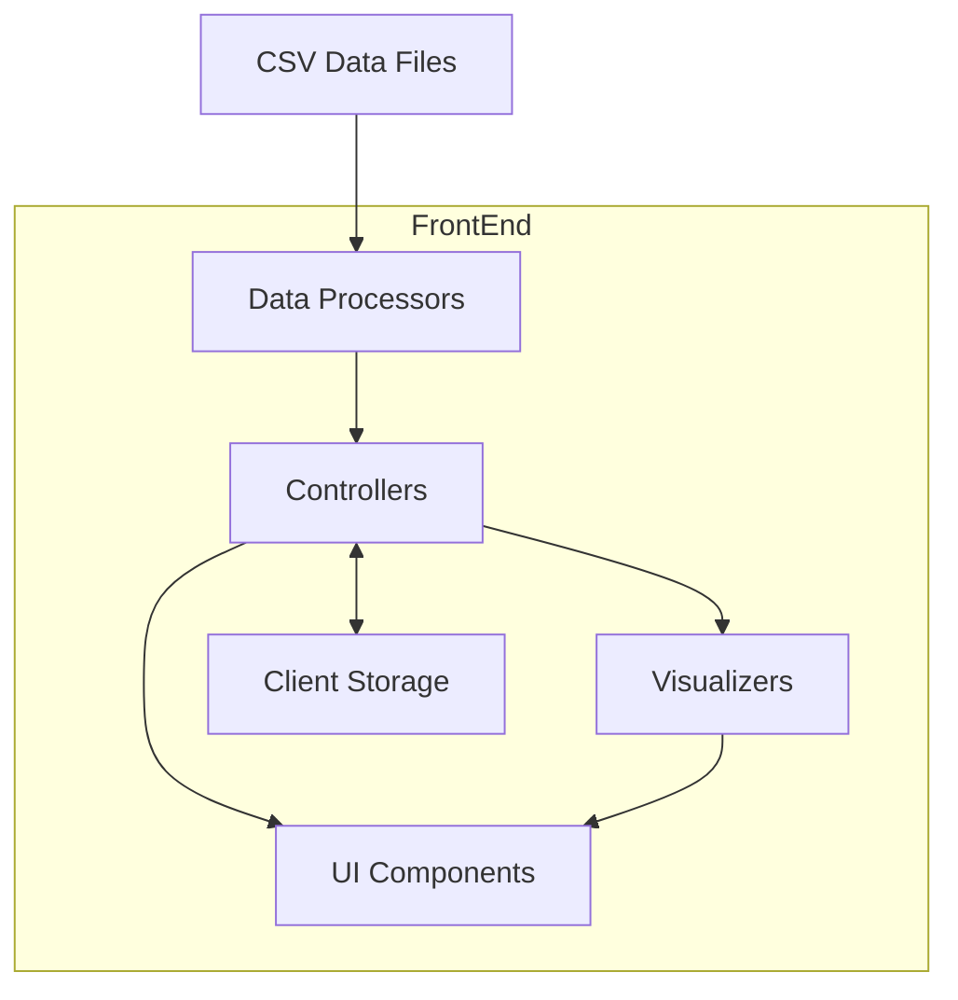

# System Patterns

## System Architecture



The ChefScore Analytics Dashboard follows a client-side MVC-like architecture with these key components:

### Data Layer
- **CSV Parser**: Handles loading and parsing raw CSV data
- **Data Transformer**: Processes raw data into structures optimized for visualization
- **Data Cache**: Stores processed data in memory for fast access

### Controller Layer
- **Main Controller**: Manages application flow and view transitions
- **Table Controller**: Handles table rendering, sorting, and filtering
- **Chart Controller**: Manages chart creation and interactions
- **Language Controller**: Handles language switching and text rendering

### View Layer
- **UI Components**: Dashboard, tables, modals, navigation elements
- **Chart Components**: Various chart types (bar, scatter, radar, etc.)
- **Detail Views**: Player-specific views and breakdowns

### Storage Layer
- **localStorage**: Persists user preferences and settings

## Key Technical Decisions

### 1. Frontend-Only Architecture
The application runs entirely in the browser without a backend server. This decision was made to:
- Eliminate server dependencies for deployment
- Allow offline usage once loaded
- Simplify hosting requirements
- Enable direct loading of local CSV files

### 2. Modular JavaScript Structure
The codebase is organized into modular components with clear responsibilities:
- **Initialization**: Application bootstrap and setup
- **Data Processing**: Data loading, parsing, and transformation
- **Visualization**: Chart creation and configuration
- **UI Management**: DOM manipulation and event handling
- **Utilities**: Helper functions and common operations

### 3. Chart Library Selection
Chart.js was selected as the visualization library because it:
- Provides all required chart types
- Has good performance with large datasets
- Offers consistent styling and interaction patterns
- Supports responsive sizing
- Has well-documented customization options

### 4. Internationalization Approach
Internationalization is implemented using:
- Translation dictionaries stored as JavaScript objects
- Text key substitution based on selected language
- Persistent language preference in localStorage
- On-the-fly language switching without page reload

## Design Patterns in Use

### Module Pattern
The application uses the module pattern to organize code into self-contained units with private and public interfaces. This provides encapsulation and prevents global namespace pollution.

```javascript
const DataProcessor = (function() {
    // Private variables and functions
    let processedData = null;
    
    function processRawData(rawData) {
        // Implementation
    }
    
    // Public API
    return {
        loadData: function(csvData) {
            // Implementation using private functions
        },
        getProcessedData: function() {
            return processedData;
        }
    };
})();
```

### Observer Pattern
The application implements a simple observer pattern for events like data loading, language changes, and view transitions.

```javascript
// Event publisher
function notifyLanguageChange(newLanguage) {
    // Notify all subscribers
}

// Event subscribers
function updateUIForLanguage(newLanguage) {
    // Update UI elements
}
```

### Factory Pattern
Chart creation uses a factory pattern to instantiate different chart types with consistent configuration.

```javascript
function createChart(type, data, options) {
    // Common configuration
    const baseConfig = {
        responsive: true,
        // Other common settings
    };
    
    // Type-specific configuration
    switch(type) {
        case 'bar':
            // Bar chart specific settings
            break;
        case 'radar':
            // Radar chart specific settings
            break;
        // Other chart types
    }
    
    // Create and return the chart
}
```

### Strategy Pattern
Data processing strategies are selected based on data characteristics:

```javascript
function processData(data, type) {
    switch(type) {
        case 'ranking':
            return processRankingData(data);
        case 'distribution':
            return processDistributionData(data);
        // Other processing strategies
    }
}
```

## Component Relationships

### Data Flow
1. CSV data is loaded and parsed into raw JavaScript objects
2. Raw data is transformed into specialized formats for different visualizations
3. Controllers manage data access for UI components
4. UI components render based on the processed data
5. User interactions trigger controller methods for view updates

### View Hierarchy
- **Root Container**: Main application wrapper
  - **Header**: Navigation and language controls
  - **Dashboard View**: Main overview
    - **Stats Cards**: Summary statistics
    - **Main Table**: Ranking table
    - **Chart Grid**: Dashboard charts
  - **Detail Views**: Secondary screens
    - **Charts View**: Expanded charts
    - **Analytics View**: Category analysis
    - **Player Detail**: Individual player view

### Dependency Relationships
- Chart components depend on the Chart.js library
- UI components depend on Controllers for data
- Controllers depend on Data Processors for structured data
- All text-containing components depend on the Language Controller

## Error Handling Strategy

1. **Data Validation**: Verify CSV structure and content before processing
2. **Graceful Degradation**: Display alternate content when data is missing
3. **User Feedback**: Show error messages when operations fail
4. **Error Boundaries**: Contain errors within components without crashing the application
5. **Defensive Programming**: Use null checks and type validation to prevent runtime errors

## Multi-Week Data Architecture

### Weekly Data Structure

The application implements a robust multi-week data system with the following architecture:

1. **Data Storage**:
   - Weekly data is stored in CSV files in the `data/` directory
   - Files follow the naming convention `data_week_{XX}.csv` (e.g., `data_week_12.csv`)
   - A central `weeks.json` file maps week numbers to data files

2. **Data Format**:
   ```json
   // Structure of weeks.json
   [
     {
       "week": "12",      // Week number (string)
       "file": "data_week_12.csv"  // CSV filename 
     },
     ...
   ]
   ```

3. **Date Handling**:
   - Week date ranges are calculated dynamically using the `getWeekDateRange` function
   - Uses ISO week number standards based on the current year
   - No need to manually specify date ranges in weeks.json

4. **Error Resilience**:
   - Multiple fallback mechanisms for missing or corrupt `weeks.json`
   - Hardcoded fallback data in both `main.js` and `history.js`
   - Robust error handling and logging throughout

### Week Selection Flow

The week selection system follows this workflow:

1. **Initialization**:
   - `loadAvailableWeeks()` loads the week configuration from `weeks.json`
   - If loading fails, fallback data is used
   - `initializeWeeklyData()` determines the latest week and sets it as default

2. **UI Population**:
   - `populateWeekSelector()` builds the week selector dropdown
   - Week options include week numbers and dynamically calculated date ranges
   - "Latest" option is highlighted for the most recent week

3. **Week Switching**:
   - `switchWeek()` handles changing the active week
   - Loads the appropriate CSV file using the `file` property
   - Updates the UI with new data via `updateUIWithWeekData()`

4. **Data Loading**:
   - CSV files are parsed into player objects
   - Data is formatted for display in tables and charts
   - Totals and averages are calculated for dashboard statistics

5. **Error Handling**:
   - Graceful recovery from missing files
   - Appropriate user feedback for data loading issues
   - Detailed console logging for debugging

## Module Organization

The application uses a modular architecture with clear separation of concerns:

1. **Core Modules**:
   - `main.js`: Entry point and application initialization
   - `config.js`: Application settings and constants
   - `state.js`: Global state management
   - `i18n.js`: Internationalization utilities

2. **Data Management**:
   - `dataLoading.js`: Functions for loading data from files
   - `dataProcessing.js`: Data transformation and analysis

3. **UI Management**:
   - `dom.js`: DOM manipulation utilities
   - `uiUpdates.js`: Functions for updating UI elements
   - `listeners.js`: Event handling

4. **Visualization**:
   - `charts.js`: Chart creation and management
   - `history.js`: Historical data visualization

## State Management

The application uses a centralized state management approach:

1. **Global State Variables**:
   - Defined in `state.js` and imported where needed
   - Includes `availableWeeks`, `currentWeek`, `historicalData`, etc.

2. **State Initialization**:
   - Initial state loading in `initializeApp()`
   - Data loading from files or localStorage
   - Weekly data initialization via `initializeWeeklyData()`

3. **State Updates**:
   - Direct mutation of state objects
   - Event-driven updates via UI interactions
   - Data-driven updates from file loading

4. **State Persistence**:
   - Key data saved to localStorage
   - Loaded on application start if available

## Error Handling Strategy

The application implements a robust error handling approach:

1. **Graceful Degradation**:
   - Functions return fallback values rather than throwing errors
   - UI shows appropriate messages for missing data
   - Application continues to function with partial data

2. **Layered Recovery**:
   - Multiple fallback mechanisms for critical data
   - Alternative data sources when primary sources fail
   - Progressive enhancement of features based on available data

3. **User Feedback**:
   - Clear error messages for user-facing issues
   - Loading indicators during asynchronous operations
   - Empty states for missing data scenarios

4. **Debugging Support**:
   - Detailed console logging at all error points
   - Stack traces for unexpected errors
   - Feature detection and environmental logging

## File Structure

### Directory Organization

The project follows this directory structure:

```
WebappTest/
├── data/             # CSV and JSON data files
├── js/               # JavaScript modules
├── resources/        # Static resources
│   └── images/       # Image assets (icons, logos, etc.)
├── scripts/          # Utility and build scripts
├── tests/            # Test files
├── memory-bank/      # Project documentation
├── plans/            # Feature planning documents
└── index.html        # Main HTML entry point
```

### Image Resources

All images and icons are centralized in the `resources/images` directory. This includes:

- Application icons (favicon, logo)
- UI graphics and illustrations
- Any other static image assets

When referencing images in HTML or CSS, use relative paths:
```html

```

Or for CSS:
```css
background-image: url('./resources/images/background.png');
``` 