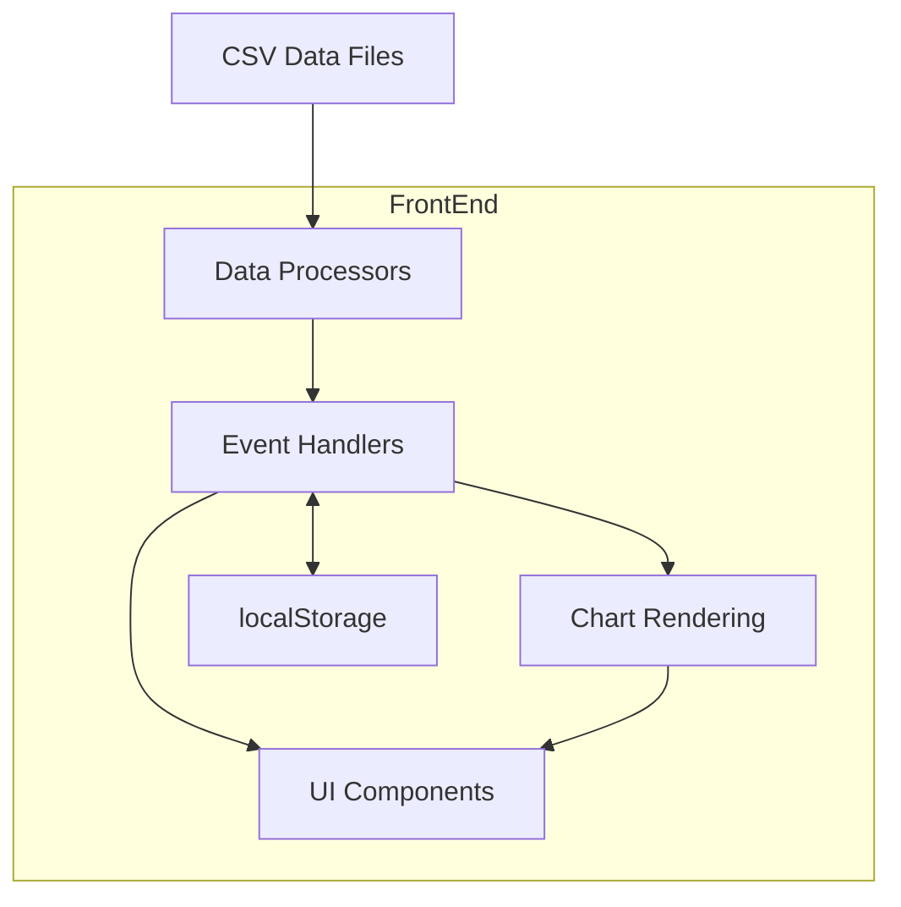

# System Patterns

## System Architecture



The Chest Analyzer follows a client-side single-page application architecture with these key components:

### Data Layer
- **CSV Parser (PapaParse)**: Handles loading and parsing raw CSV data
- **Data Processor**: Cleans and transforms raw data for visualization
- **localStorage**: Stores user preferences (language selection)

### Core Functionality
- **Event Handlers**: Manage user interactions and view transitions
- **DOM Manipulation**: Updates the UI based on user actions and data changes
- **Table Management**: Handles rendering, sorting, and filtering of data tables

### View Layer
- **UI Components**: Dashboard, tables, modals, navigation elements
- **ApexCharts**: Various chart types (donut, bar, scatter, radar, treemap)
- **Internationalization**: Language switching functionality

## Key Technical Decisions

### 1. Frontend-Only Architecture
The application runs entirely in the browser without a backend server. This decision was made to:
- Eliminate server dependencies for deployment
- Simplify hosting requirements
- Enable direct loading of local CSV files

### 2. Modular JavaScript Structure
The codebase is organized into multiple logical modules:
- **app.js**: Core application logic and integration point for all modules
- **dataLoader.js**: Loading, parsing, and processing data
- **domManager.js**: DOM reference management and UI operations
- **i18n.js**: Internationalization and language handling
- **utils.js**: Utility functions for formatting, sorting, etc.
- **renderer/**: Specialized rendering modules for different views and charts

### 3. Chart Library Selection
ApexCharts was selected as the visualization library because it:
- Provides all required chart types (donut, bar, scatter, radar, treemap)
- Has good performance with datasets
- Offers consistent styling and interaction patterns
- Supports responsive sizing
- Has good integration with the dark theme
- Provides customizable tooltips for enhanced data visualization

### 4. Internationalization Approach
Internationalization is implemented using:
- Translation objects stored as JavaScript objects
- Text key substitution based on selected language
- Persistent language preference in localStorage
- On-the-fly language switching without page reload

## Implementation Patterns

### Function Organization
The application organizes code by module purpose:

```javascript
// --- app.js - Core application logic ---
// State variables
let allPlayersData = [];
let displayData = [];

// Initialization
function initializeApp() {
  // Application bootstrap logic
}

// View navigation
function handleViewNavigation(viewName) {
  // Handle changing between views
}

// --- dataLoader.js - Data handling ---
async function loadStaticCsvData(playersArray, displayArray, columnHeaders, sortFunction, sortState, saveCallback) {
  // Data loading and processing logic
}

// --- renderer/analyticsRenderer.js - Analytics specific rendering ---
function renderSourceImportance(containerId, data) {
  // Render treemap chart for source importance
}

function renderClanComposition(containerId, data) {
  // Render clan composition chart
}
```

### View Initialization Pattern
The application uses a sequential initialization approach for complex views like Analytics:

```javascript
function handleViewNavigation(viewName) {
  // Show the appropriate section
  domManager.showView(viewName);
  
  // Update active nav state
  domManager.updateNavLinkActiveState(viewName);
  
  // Handle specific view logic
  switch (viewName) {
    case 'analytics':
      // Analytics initialization - sequential creation order is important
      if (allPlayersData.length > 0) {
        // First create Clan Analysis
        createClanAnalysisView(allPlayersData);
        // Then create Category Analysis
        createCategoryAnalysisView(allPlayersData);
      }
      break;
    // Other cases...
  }
}
```

### Analytics Page Organization Pattern
The Analytics page is structured with a logical flow from clan-level analysis to category-level details:

```javascript
// Clan Analysis is created first
function createClanAnalysisView(data) {
  // Calculate clan metrics
  const clanMetrics = calculateClanMetrics(data);
  
  // Update clan summary statistics
  updateClanSummaryStats(clanMetrics);
  
  // Render clan-specific charts
  renderClanComposition('clan-composition-container', data);
  renderContributionCurve('contribution-curve-container', data);
}

// Category Analysis is created second
function createCategoryAnalysisView(data) {
  // Render source importance as treemap
  renderSourceImportance('source-importance-container', data);
  
  // Render all sources by score
  renderAllSourcesByScore('all-sources-container', data);
  
  // Render top sources with player contributions
  renderTop10SourcesWithPlayers('top-sources-players-container', data);
}
```

### Error Handling in Chart Tooltips
The application implements robust error handling for chart tooltips:

```javascript
function renderSourceImportance(containerId, data) {
  // Chart configuration
  const options = {
    // ... other options ...
    tooltip: {
      custom: function({series, seriesIndex, dataPointIndex, w}) {
        // Safety checks to prevent undefined errors
        if (!w || !w.globals || !w.globals.labels || dataPointIndex >= w.globals.labels.length) {
          return '<div class="custom-tooltip">No data available</div>';
        }
        
        // Safe access to data with fallbacks
        const label = w.globals.labels[dataPointIndex] || 'Unknown';
        const value = series[seriesIndex][dataPointIndex] || 0;
        
        // Construct tooltip HTML
        return `<div class="custom-tooltip">
                  <span>${label}</span>
                  <span class="value">${value}</span>
                </div>`;
      }
    }
  };
}
```

### Event Handling Pattern
The application uses direct event listeners attached during initialization:

```javascript
function setupEventListeners() {
  if (filterInput) {
    filterInput.addEventListener("input", handleFilter);
  }
  
  if (rankingTableBody) {
    rankingTableBody.addEventListener("click", handleTableRowClick);
  }
  
  // Additional listeners...
}
```

### View Management Pattern
The application uses a view switching approach to show/hide sections:

```javascript
function showView(viewName) {
  // Hide all sections
  allSections.forEach(section => {
    if (section) section.classList.add("hidden");
  });
  
  // Show the requested section
  const targetSection = document.getElementById(`${viewName}-section`);
  if (targetSection) {
    targetSection.classList.remove("hidden");
  }
}
```

## Component Relationships

### Data Flow
1. CSV data is loaded and parsed into raw JavaScript objects
2. Data is cleaned and processed for use in visualizations
3. UI components are rendered based on the processed data
4. User interactions trigger event handlers
5. Event handlers update the UI or transition to different views

### View Hierarchy
- **Header**: Navigation and language controls
- **Main Content Area**:
  - **Dashboard View**: Main overview with statistics, ranking table, and charts
  - **Detailed Table View**: Full data table with all columns
  - **Charts View**: Expanded versions of dashboard charts
  - **Analytics View**: 
    - **Clan Analysis**: Clan metrics, composition charts, and contribution curve
    - **Category Analysis**: Source importance treemap, score analysis, and player contributions
  - **Score System View**: Scoring rules table
  - **Player Detail View**: Individual player statistics and charts

## Error Handling Strategy

1. **Input Validation**: Verify CSV data before processing
2. **Graceful Degradation**: Show meaningful content when operations fail
3. **User Feedback**: Display status messages for operations
4. **Console Logging**: Detailed logs for debugging
5. **Try/Catch Blocks**: Contain errors to prevent application crashes
6. **Safety Checks in Chart Tooltips**: Comprehensive null/undefined checks to prevent errors
7. **Data Access Safety**: Using optional chaining and nullish coalescing for safe property access 