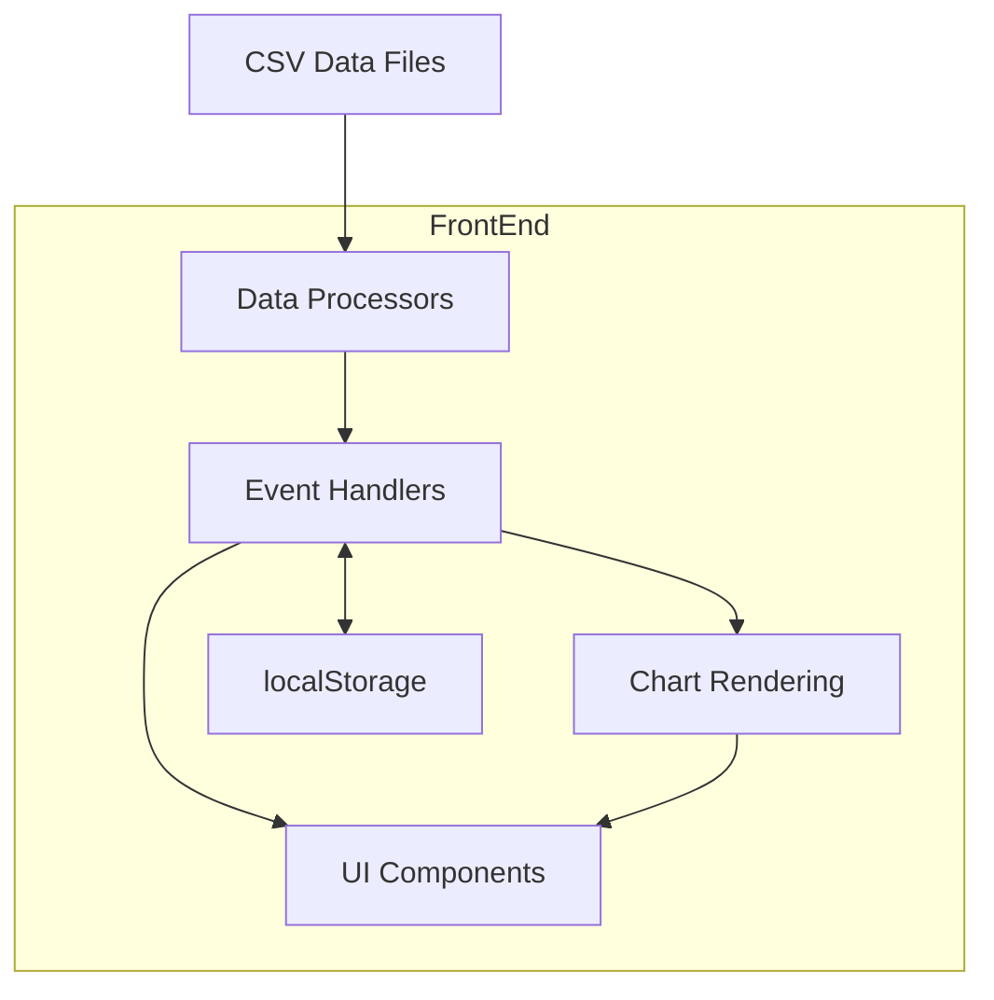

# System Patterns

## System Architecture



The Chest Analyzer follows a client-side single-page application architecture with these key components:

### Data Layer
- **CSV Parser (PapaParse)**: Handles loading and parsing raw CSV data
- **Data Processor**: Cleans and transforms raw data for visualization
- **localStorage**: Stores user preferences (language selection)

### Core Functionality
- **Event Handlers**: Manage user interactions and view transitions
- **DOM Manipulation**: Updates the UI based on user actions and data changes
- **Table Management**: Handles rendering, sorting, and filtering of data tables

### View Layer
- **UI Components**: Dashboard, tables, modals, navigation elements
- **ApexCharts**: Various chart types (donut, bar, scatter, radar, treemap)
- **Internationalization**: Language switching functionality

## Key Technical Decisions

### 1. Frontend-Only Architecture
The application runs entirely in the browser without a backend server. This decision was made to:
- Eliminate server dependencies for deployment
- Simplify hosting requirements
- Enable direct loading of local CSV files

### 2. Modular JavaScript Structure
The codebase is organized into multiple logical modules:
- **app.js**: Core application logic and integration point for all modules
- **dataLoader.js**: Loading, parsing, and processing data
- **domManager.js**: DOM reference management and UI operations
- **i18n.js**: Internationalization and language handling
- **utils.js**: Utility functions for formatting, sorting, etc.
- **renderer/**: Specialized rendering modules for different views and charts

### 3. Chart Library Selection
ApexCharts was selected as the visualization library because it:
- Provides all required chart types (donut, bar, scatter, radar, treemap)
- Has good performance with datasets
- Offers consistent styling and interaction patterns
- Supports responsive sizing
- Has good integration with the dark theme
- Provides customizable tooltips for enhanced data visualization

### 4. Internationalization Approach
Internationalization is implemented using:
- Translation objects stored as JavaScript objects
- Text key substitution based on selected language
- Persistent language preference in localStorage
- On-the-fly language switching without page reload

## Implementation Patterns

### Function Organization
The application organizes code by module purpose:

```javascript
// --- app.js - Core application logic ---
// State variables
let allPlayersData = [];
let displayData = [];

// Initialization
function initializeApp() {
  // Application bootstrap logic
}

// View navigation
function handleViewNavigation(viewName) {
  // Handle changing between views
}

// --- dataLoader.js - Data handling ---
async function loadStaticCsvData(playersArray, displayArray, columnHeaders, sortFunction, sortState, saveCallback) {
  // Data loading and processing logic
}

// --- renderer/analyticsRenderer.js - Analytics specific rendering ---
function renderSourceImportance(containerId, data) {
  // Render treemap chart for source importance
}

function renderClanComposition(containerId, data) {
  // Render clan composition chart
}
```

### View Initialization Pattern
The application uses a sequential initialization approach for complex views like Analytics:

```javascript
function handleViewNavigation(viewName) {
  // Show the appropriate section
  domManager.showView(viewName);
  
  // Update active nav state
  domManager.updateNavLinkActiveState(viewName);
  
  // Handle specific view logic
  switch (viewName) {
    case 'analytics':
      // Analytics initialization - sequential creation order is important
      if (allPlayersData.length > 0) {
        // First create Clan Analysis
        createClanAnalysisView(allPlayersData);
        // Then create Category Analysis
        createCategoryAnalysisView(allPlayersData);
      }
      break;
    // Other cases...
  }
}
```

### Analytics Page Organization Pattern
The Analytics page is structured with a logical flow from clan-level analysis to category-level details:

```javascript
// Clan Analysis is created first
function createClanAnalysisView(data) {
  // Calculate clan metrics
  const clanMetrics = calculateClanMetrics(data);
  
  // Update clan summary statistics
  updateClanSummaryStats(clanMetrics);
  
  // Render clan-specific charts
  renderClanComposition('clan-composition-container', data);
  renderContributionCurve('contribution-curve-container', data);
}

// Category Analysis is created second
function createCategoryAnalysisView(data) {
  // Render source importance as treemap
  renderSourceImportance('source-importance-container', data);
  
  // Render all sources by score
  renderAllSourcesByScore('all-sources-container', data);
  
  // Render top sources with player contributions
  renderTop10SourcesWithPlayers('top-sources-players-container', data);
}
```

### Error Handling in Chart Tooltips
The application implements robust error handling for chart tooltips:

```javascript
function renderSourceImportance(containerId, data) {
  // Chart configuration
  const options = {
    // ... other options ...
    tooltip: {
      custom: function({series, seriesIndex, dataPointIndex, w}) {
        // Safety checks to prevent undefined errors
        if (!w || !w.globals || !w.globals.labels || dataPointIndex >= w.globals.labels.length) {
          return '<div class="custom-tooltip">No data available</div>';
        }
        
        // Safe access to data with fallbacks
        const label = w.globals.labels[dataPointIndex] || 'Unknown';
        const value = series[seriesIndex][dataPointIndex] || 0;
        
        // Construct tooltip HTML
        return `<div class="custom-tooltip">
                  <span>${label}</span>
                  <span class="value">${value}</span>
                </div>`;
      }
    }
  };
}
```

### Event Handling Pattern
The application uses direct event listeners attached during initialization:

```javascript
function setupEventListeners() {
  if (filterInput) {
    filterInput.addEventListener("input", handleFilter);
  }
  
  if (rankingTableBody) {
    rankingTableBody.addEventListener("click", handleTableRowClick);
  }
  
  // Additional listeners...
}
```

### View Management Pattern
The application uses a view switching approach to show/hide sections:

```javascript
function showView(viewName) {
  // Hide all sections
  allSections.forEach(section => {
    if (section) section.classList.add("hidden");
  });
  
  // Show the requested section
  const targetSection = document.getElementById(`${viewName}-section`);
  if (targetSection) {
    targetSection.classList.remove("hidden");
  }
}
```

## Component Relationships

### Data Flow
1. CSV data is loaded and parsed into raw JavaScript objects
2. Data is cleaned and processed for use in visualizations
3. UI components are rendered based on the processed data
4. User interactions trigger event handlers
5. Event handlers update the UI or transition to different views

### View Hierarchy
- **Header**: Navigation and language controls
- **Main Content Area**:
  - **Dashboard View**: Main overview with statistics, ranking table, and charts
  - **Detailed Table View**: Full data table with all columns
  - **Charts View**: Expanded versions of dashboard charts
  - **Analytics View**: 
    - **Clan Analysis**: Clan metrics, composition charts, and contribution curve
    - **Category Analysis**: Source importance treemap, score analysis, and player contributions
  - **Score System View**: Scoring rules table
  - **Player Detail View**: Individual player statistics and charts

## Error Handling Strategy

1. **Input Validation**: Verify CSV data before processing
2. **Graceful Degradation**: Show meaningful content when operations fail
3. **User Feedback**: Display status messages for operations
4. **Console Logging**: Detailed logs for debugging
5. **Try/Catch Blocks**: Contain errors to prevent application crashes
6. **Safety Checks in Chart Tooltips**: Comprehensive null/undefined checks to prevent errors
7. **Data Access Safety**: Using optional chaining and nullish coalescing for safe property access 

## Architecture Overview

The application follows a modular design pattern with clear separation of concerns between different components. The architecture is client-side only, with all data processing and rendering happening in the browser. The application is structured as follows:

1. **Core Modules**: Handle fundamental application functionality
2. **Renderer Modules**: Specialized for different visualization needs
3. **Data Processing**: CSV parsing and data transformation
4. **UI Components**: Reusable interface components
5. **Event Handling**: Centralized event management

## Key Design Patterns

### Module Organization

The application uses ES modules to organize code into logical units:

```
app/
├── app.js                // Core application logic and integration of modules
├── utils.js              // Utility functions (sorting, formatting, date handling, etc.)
├── dataLoader.js         // CSV data loading, parsing, and cleaning
├── i18n.js               // Internationalization functions and language management
├── domManager.js         // DOM element reference management and UI updates
├── eventListeners.js     // Event attachment and handling for user interactions
└── renderer/             // Contains view-specific rendering modules:
    ├── dashboardRenderer.js      // Rendering for dashboard (stats, charts)
    ├── tableRenderer.js          // Table rendering functions
    ├── chartRenderer.js          // Chart creation and management (ApexCharts)
    ├── playerDetailRenderer.js   // Player detail view rendering
    └── analyticsRenderer.js      // Analytics visualizations and reports
```

### State Management

The application uses a simple state management approach with several global variables in the main application module:

1. **Data State**:
   - `allPlayersData`: Array of all player data objects
   - `displayData`: Array of filtered player data objects
   - `allColumnHeaders`: Array of column headers from CSV
   - `scoreRulesData`: Array of score rules data objects
   - `currentWeek`: Current selected week number
   - `availableWeeks`: Array of available week numbers

2. **UI State**:
   - `dashboardSortState`: Object tracking sort column and direction for dashboard
   - `detailedTableSortState`: Object tracking sort column and direction for detailed table
   - `scoreRulesSortState`: Object tracking sort column and direction for score rules table

3. **State Exposure**:
   - Critical data like `allPlayersData` is exposed to the window object as a fallback mechanism
   - This provides emergency access for components that might lose reference to the data

### Internationalization

The application supports multiple languages (currently German and English):

1. **Translation Dictionaries**:
   - Language-specific text content is stored in translation objects in `i18n.js`
   - Translations include support for parameterized text using `{0}`, `{1}`, etc.

2. **Language Switching**:
   - Language preference is stored in `localStorage`
   - UI is dynamically updated when language is changed
   - All translatable elements use data attributes or translation keys

3. **Date Formatting**:
   - Locale-specific date formats are implemented
   - German format: DD.MM-DD.MM.YYYY (e.g., '31.03-06.04.2025')
   - English format: MM/DD-MM/DD/YYYY (e.g., '03/31-04/06/2025')
   - The `getWeekDateRange` function handles format conversion based on language

4. **Timestamp Persistence**:
   - "Last updated" timestamps are stored in localStorage
   - During language switches, timestamps are preserved and reformatted
   - Fallback mechanisms ensure timestamps are never lost during UI updates

### Data Loading and Processing

1. **CSV Parsing**:
   - PapaParse library parses CSV files into JavaScript objects
   - Cleaned data is stored in the application state

2. **Data Transformation**:
   - Raw CSV data is cleaned and transformed before use
   - Numeric strings are converted to numbers
   - Data validation ensures required fields exist

3. **Week-Based Data Loading**:
   - Data can be loaded from specific week files
   - Week detection identifies available data files
   - Date range formatter converts week numbers to human-readable dates

### Chart Rendering

1. **ApexCharts Integration**:
   - Charts are created using the ApexCharts library
   - Consistent theming across all charts
   - Responsive sizing for different screen dimensions

2. **Chart Registry**:
   - Charts are tracked in a registry to manage lifecycle
   - Proper cleanup on chart destruction to prevent memory leaks

3. **Modal Chart Rendering**:
   - Charts can be expanded to full-screen modal view
   - Robust fallback mechanisms ensure data access for modal charts
   - Player data reference is maintained for charts via multiple pathways:
     - Primary: Direct reference to playerDataRef in domManager
     - Secondary: Access via window.allPlayersData global reference
     - Player data is never lost during UI transitions

4. **Data Access Safety**:
   - Charts implement comprehensive null checking
   - Fallback content displayed when data is unavailable
   - Clear error handling with user-friendly messages
   - Logging for debugging rendering issues

### DOM Management

1. **Element References**:
   - DOM elements are cached for performance in the `domManager.js` module
   - References are organized by functional area

2. **UI Updates**:
   - Changes to UI are centralized in dedicated update functions
   - Defensive programming prevents errors with missing elements

### Event Handling

1. **Centralized Event Listeners**:
   - All event setup is handled in the `eventListeners.js` module
   - Consistent pattern for attaching listeners

2. **Event Delegation**:
   - For dynamically created elements like table rows

## Component Design

### Tables

1. **Table Rendering**:
   - Tables are created dynamically based on data
   - Support for sorting, filtering, and pagination
   - Responsive design with horizontal scrolling for many columns

2. **Sorting Mechanism**:
   - Click handlers on table headers toggle sort direction
   - Visual indicators show current sort column and direction
   - Sort functions handle different data types appropriately

### Charts

1. **Dashboard Charts**:
   - Compact visualizations for the dashboard view
   - Expandable to full-screen modal view
   - Consistent color scheme and styling

2. **Chart Types**:
   - Bar charts for rankings and distributions
   - Donut charts for proportional data
   - Scatter plots for correlation analysis
   - Radar charts for multi-dimensional data

3. **Tooltips**:
   - Custom tooltip formatting for each chart type
   - Robust null/undefined checks to prevent errors
   - Fallback formats for missing data

### Navigation

1. **View Management**:
   - Single-page application with different views
   - Only one view is visible at a time
   - Smooth transitions between views

2. **Breadcrumb Navigation**:
   - Shows current location in the application
   - Provides easy way back to dashboard

### Week Selection

1. **Calendar Widget**:
   - Uses Flatpickr library for date selection
   - Highlights only weeks with available data
   - Displays week number and date range

2. **Data Loading**:
   - Loads data for selected week on demand
   - Updates all views to reflect selected week's data

## Error Handling

1. **Defensive Programming**:
   - Comprehensive null/undefined checks
   - Fallback values for missing data
   - Try/catch blocks around critical operations

2. **User Feedback**:
   - Status messages for loading, success, and errors
   - Clear error states in the UI
   - Fallback content when data is unavailable

3. **Console Logging**:
   - Detailed logging for debugging
   - Error reporting for critical failures

## Code Organization Principles

1. **Clear Responsibility**:
   - Each module has a distinct purpose
   - Functions are grouped by related functionality

2. **Interface Design**:
   - Modules expose a clear public interface
   - Implementation details are hidden when possible

3. **State Management**:
   - State is centralized in the app module
   - Components access state through controlled interfaces
   - Fallback mechanisms ensure critical data is always accessible

4. **Error Recovery**:
   - Components can recover from errors
   - UI never breaks completely if one component fails
   - Multiple data access pathways provide redundancy

## Internationalization Approach

The application implements a robust internationalization system to support multiple languages. Key aspects include:

1. **Central Translation Registry**:
   - All text content is stored in `i18n.js`
   - Translation keys follow a hierarchical pattern (e.g., `dashboard.totalPlayersLabel`)
   - Parameters in translation strings use `{0}`, `{1}` placeholders

2. **Dynamic UI Updates**:
   - All UI elements update when language changes without page reload
   - Changes affect text content, formatting, and date displays

3. **Locale-Aware Formatting**:
   - Numbers formatted according to locale (e.g., using commas or periods for thousands)
   - Dates follow locale-specific patterns

4. **State Preservation During Language Switches**:
   - Application state is maintained when switching languages
   - Active view, selected data, and UI state persist across language changes
   - Timestamps and date ranges are reformatted to match the new language

## Component Interaction Patterns

1. **Module References**:
   - Modules explicitly import dependencies
   - Circular dependencies are avoided

2. **Event-Based Communication**:
   - Components communicate through events when appropriate

3. **Shared State**:
   - Core application state serves as source of truth

## Responsive Design Approach

1. **Mobile-First Considerations**:
   - Design works on small screens and scales up
   - Different layouts for mobile and desktop

2. **Adaptive Components**:
   - Charts resize based on container dimensions
   - Tables implement horizontal scrolling on small screens

## Performance Patterns

1. **Efficient DOM Operations**:
   - Element references are cached
   - Batch DOM updates where possible

2. **Data Transformation**:
   - Data is processed once after loading
   - Subsequent operations use the transformed data

3. **Chart Optimization**:
   - Charts are created only when needed
   - Destroyed when not visible to free resources

## Testing Approach

1. **Unit Testing**:
   - Individual functions and modules are tested in isolation
   - Jest test framework with JSDOM for DOM simulation

2. **Integration Testing**:
   - Tests interactions between modules
   - Verifies correct behavior of combined components

3. **Mock Objects**:
   - External dependencies are mocked for testing
   - Browser APIs (localStorage, fetch) have test equivalents 