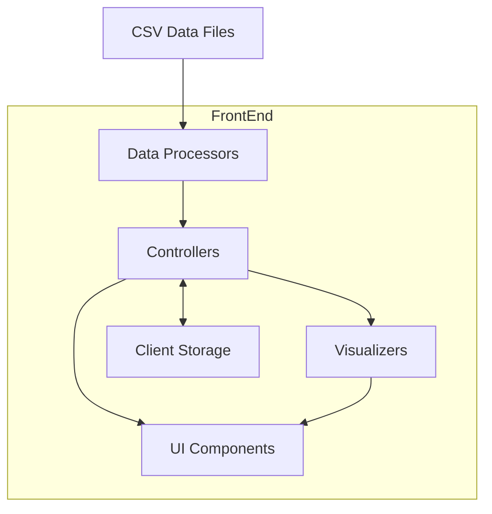

# System Patterns

## System Architecture



The ChefScore Analytics Dashboard follows a client-side MVC-like architecture with these key components:

### Data Layer
- **CSV Parser**: Handles loading and parsing raw CSV data
- **Data Transformer**: Processes raw data into structures optimized for visualization
- **Data Cache**: Stores processed data in memory for fast access

### Controller Layer
- **Main Controller**: Manages application flow and view transitions
- **Table Controller**: Handles table rendering, sorting, and filtering
- **Chart Controller**: Manages chart creation and interactions
- **Language Controller**: Handles language switching and text rendering

### View Layer
- **UI Components**: Dashboard, tables, modals, navigation elements
- **Chart Components**: Various chart types (bar, scatter, radar, etc.)
- **Detail Views**: Player-specific views and breakdowns

### Storage Layer
- **localStorage**: Persists user preferences and settings

## Key Technical Decisions

### 1. Frontend-Only Architecture
The application runs entirely in the browser without a backend server. This decision was made to:
- Eliminate server dependencies for deployment
- Allow offline usage once loaded
- Simplify hosting requirements
- Enable direct loading of local CSV files

### 2. Modular JavaScript Structure
The codebase is organized into modular components with clear responsibilities:
- **Initialization**: Application bootstrap and setup
- **Data Processing**: Data loading, parsing, and transformation
- **Visualization**: Chart creation and configuration
- **UI Management**: DOM manipulation and event handling
- **Utilities**: Helper functions and common operations

### 3. Chart Library Selection
Chart.js was selected as the visualization library because it:
- Provides all required chart types
- Has good performance with large datasets
- Offers consistent styling and interaction patterns
- Supports responsive sizing
- Has well-documented customization options

### 4. Internationalization Approach
Internationalization is implemented using:
- Translation dictionaries stored as JavaScript objects
- Text key substitution based on selected language
- Persistent language preference in localStorage
- On-the-fly language switching without page reload

## Design Patterns in Use

### Module Pattern
The application uses the module pattern to organize code into self-contained units with private and public interfaces. This provides encapsulation and prevents global namespace pollution.

```javascript
const DataProcessor = (function() {
    // Private variables and functions
    let processedData = null;
    
    function processRawData(rawData) {
        // Implementation
    }
    
    // Public API
    return {
        loadData: function(csvData) {
            // Implementation using private functions
        },
        getProcessedData: function() {
            return processedData;
        }
    };
})();
```

### Observer Pattern
The application implements a simple observer pattern for events like data loading, language changes, and view transitions.

```javascript
// Event publisher
function notifyLanguageChange(newLanguage) {
    // Notify all subscribers
}

// Event subscribers
function updateUIForLanguage(newLanguage) {
    // Update UI elements
}
```

### Factory Pattern
Chart creation uses a factory pattern to instantiate different chart types with consistent configuration.

```javascript
function createChart(type, data, options) {
    // Common configuration
    const baseConfig = {
        responsive: true,
        // Other common settings
    };
    
    // Type-specific configuration
    switch(type) {
        case 'bar':
            // Bar chart specific settings
            break;
        case 'radar':
            // Radar chart specific settings
            break;
        // Other chart types
    }
    
    // Create and return the chart
}
```

### Strategy Pattern
Data processing strategies are selected based on data characteristics:

```javascript
function processData(data, type) {
    switch(type) {
        case 'ranking':
            return processRankingData(data);
        case 'distribution':
            return processDistributionData(data);
        // Other processing strategies
    }
}
```

## Component Relationships

### Data Flow
1. CSV data is loaded and parsed into raw JavaScript objects
2. Raw data is transformed into specialized formats for different visualizations
3. Controllers manage data access for UI components
4. UI components render based on the processed data
5. User interactions trigger controller methods for view updates

### View Hierarchy
- **Root Container**: Main application wrapper
  - **Header**: Navigation and language controls
  - **Dashboard View**: Main overview
    - **Stats Cards**: Summary statistics
    - **Main Table**: Ranking table
    - **Chart Grid**: Dashboard charts
  - **Detail Views**: Secondary screens
    - **Charts View**: Expanded charts
    - **Analytics View**: Category analysis
    - **Player Detail**: Individual player view

### Dependency Relationships
- Chart components depend on the Chart.js library
- UI components depend on Controllers for data
- Controllers depend on Data Processors for structured data
- All text-containing components depend on the Language Controller

## Error Handling Strategy

1. **Data Validation**: Verify CSV structure and content before processing
2. **Graceful Degradation**: Display alternate content when data is missing
3. **User Feedback**: Show error messages when operations fail
4. **Error Boundaries**: Contain errors within components without crashing the application
5. **Defensive Programming**: Use null checks and type validation to prevent runtime errors 