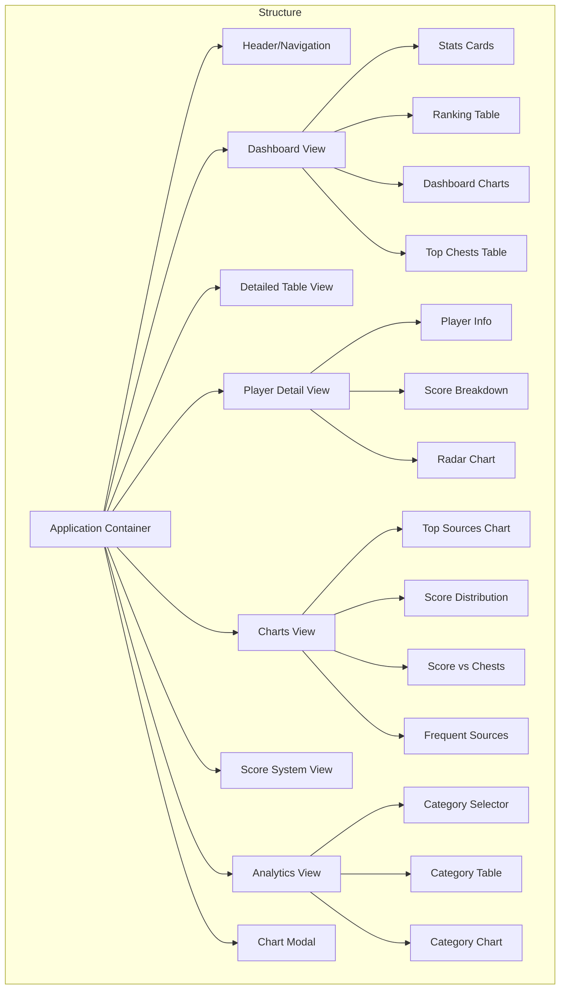

# UI/UX

## Application Structure

## Design System

### Color Palette

- **Primary**: Amber/Gold (#f59e0b) - Used for key headings, important UI elements
- **Background**: Dark slate (#0f172a) - Main application background
- **Card Background**: Darker slate (#1e293b) - Card and section backgrounds
- **Text Primary**: White (#ffffff) - Main text
- **Text Secondary**: Light gray (#94a3b8) - Secondary and supporting text
- **Border**: Medium slate (#334155) - Borders and dividers
- **Accent**: Teal (#0d9488) - Highlights and accents
- **Error**: Red (#ef4444) - Error messages and alerts
- **Success**: Green (#10b981) - Success messages
- **Info**: Blue (#3b82f6) - Informational messages

### Typography

- **Primary Font**: Inter (sans-serif)
- **Secondary Font**: Serif font for decorative headings
- **Base Size**: 16px
- **Scale**: 1.25 (major third)

### Spacing

- **Base Unit**: 0.25rem (4px)
- **Scale**: 4px, 8px, 16px, 24px, 32px, 48px, 64px

### Components

#### Cards
- Rounded corners (0.5rem)
- Subtle shadows
- Border accent on important cards
- Padding: 1.5rem

#### Tables
- Alternating row colors for readability
- Hover effect on interactive rows
- Thin borders between rows
- Sticky headers
- Sortable columns with indicators

#### Charts
- Consistent color scheme across chart types
- Tooltips for additional information
- Interactive elements (hover effects)
- Expand buttons for larger views
- Loading spinners during rendering

#### Buttons
- Clear hover states
- Focus indicators
- Consistent padding (0.5rem 1rem)
- Text or icon buttons as appropriate

#### Forms
- Clearly labeled inputs
- Sufficient spacing between elements
- Error states with helpful messages
- Focus states for accessibility

## View Specifications

### Dashboard View
- Summary statistics in card grid at top
- Main ranking table with filtering
- Four chart cards in 2x2 grid
- Top 5 players by chest count in sidebar

### Detailed Table View
- Full-width table with all data columns
- Horizontal scrolling for many columns
- Fixed header for easier navigation
- Back button to return to dashboard

### Charts View
- Large versions of the dashboard charts
- 2x2 grid layout
- Description text for each chart
- Consistent interactive features

### Analytics View
- Category selector dropdown
- Table showing players ranked by selected category
- Bar chart showing category distribution
- Placeholders for future analysis types

### Score System View
- Table showing scoring rules
- Type and level groupings
- Points column with clear formatting

### Player Detail View
- Player information card with key stats
- Score breakdown list by category
- Radar chart showing top performance areas
- Download option for player data

### Chart Modal
- Expanded version of a single chart
- Close button
- Semi-transparent backdrop
- Maintains interactivity

## Interaction Patterns

### Navigation
- Primary navigation via header links
- Back buttons for nested views
- Breadcrumb trail for context

### Table Interactions
- Click column headers to sort
- Click rows to view details
- Filter input for quick searching
- Horizontal scrolling for wide tables

### Chart Interactions
- Hover for tooltips with detailed data
- Click expand button for larger view
- Chart-specific interactions (zoom, pan)
- Legend toggles for data series

### Language Switching
- Language toggle buttons in header
- Immediate UI update on language change
- Persistent preference across sessions

### Status Messages
- Temporary notifications for actions
- Color-coded by message type
- Auto-dismissal after timeout
- User-dismissible

## Key UX Principles

1. **Progressive Disclosure**: Start with overview, drill down for details
2. **Consistency**: Maintain consistent patterns across all views
3. **Feedback**: Provide clear feedback for all user actions
4. **Efficiency**: Minimize clicks for common tasks
5. **Learnability**: Intuitive interface requiring minimal instruction
6. **Error Prevention**: Guide users away from errors
7. **Performance Focus**: Optimize for responsiveness and speed
8. **Accessibility**: Design for users of all abilities

## UX Rubric

### A-Grade Requirements
- ✅ Clear information hierarchy
- ✅ Intuitive navigation
- ✅ Responsive design
- ✅ Consistent interaction patterns
- ✅ Helpful error states
- ✅ Appropriate feedback
- ✅ Efficient workflows
- ⏳ Comprehensive accessibility

### B-Grade Requirements
- ✅ Functional design
- ✅ Basic responsiveness
- ✅ Working navigation
- ✅ Limited error handling
- ✅ Some visual consistency
- ⏳ Partial accessibility

### C-Grade Requirements
- ✅ Working basic functionality
- ✅ Minimal design consideration
- ✅ Functional but not optimized
- ✅ Limited feedback for users

## Recent UI Simplification

### Removal of Week Selection UI

The application UI has been simplified by removing all week selection and history comparison features. This change:

1. **Streamlines the UI**
   - Removes week selector dropdown/controls
   - Eliminates historical comparison views
   - Focuses interface on single dataset visualization

2. **Improves User Experience**
   - Reduces cognitive load with simpler interface
   - Provides clearer data presentation
   - Maintains core analytics functionality

3. **Design Updates**
   - Main dashboard now shows only current data
   - Charts and tables present single dataset information
   - Navigation simplified without week-switching controls

This architectural simplification allows for a more focused user experience while maintaining the core analytics functionality 