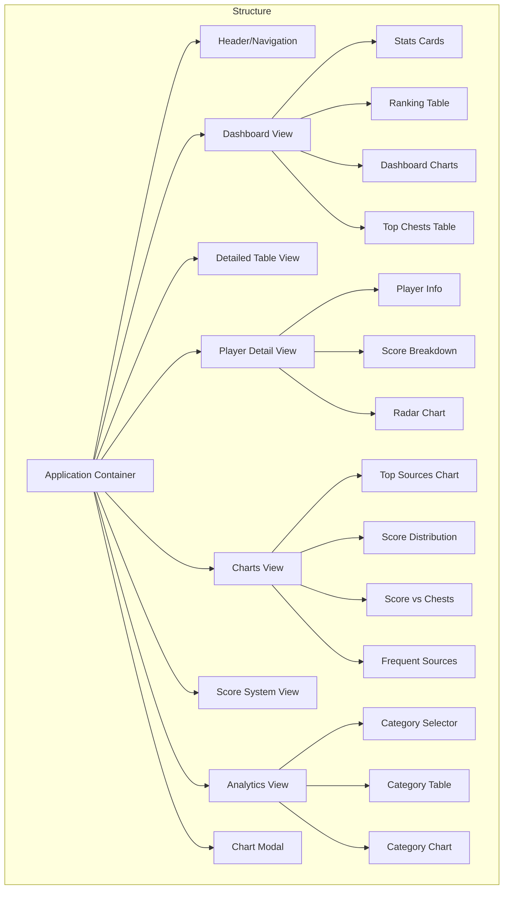

# UI/UX

## Application Structure

## Design System

### Color Palette

- **Primary**: Amber/Gold (#f59e0b) - Used for key headings, important UI elements
- **Background**: Dark slate (#0f172a) - Main application background
- **Card Background**: Darker slate (#1e293b) - Card and section backgrounds
- **Text Primary**: White (#ffffff) - Main text
- **Text Secondary**: Light gray (#94a3b8) - Secondary and supporting text
- **Border**: Amber/Gold with lower opacity - Borders and dividers
- **Secondary**: Rose (#e11d48) - Used for accent elements

### Typography

- **Primary Font**: Inter (sans-serif)
- **Secondary Font**: Merriweather (serif) 
- **Heading Font**: Cinzel Decorative (for fantasy elements)
- **Base Size**: 16px

### Components

#### Cards
- Rounded corners (0.5rem)
- Dark background with border
- Icon + heading combinations
- Shadow effects for depth
- Consistent internal spacing

#### Tables
- Sticky headers
- Alternating row shades
- Clickable rows for detail views
- Sortable columns with indicators
- Horizontal scrolling for wide tables

#### Charts
- ApexCharts library implementation
- Consistent theme across chart types
- Interactive tooltips
- Expand option to view in modal
- Responsive sizing

#### Buttons
- Clear hover states
- Icon + text combinations
- Border styling for secondary actions
- Focus indicators for accessibility

#### Navigation
- Tab-like desktop navigation
- Mobile hamburger menu
- Active state indicators
- Language switcher in header

## View Specifications

### Dashboard View
- Summary statistics in 5-card grid at top
- Main ranking table with filtering
- Four chart cards (Top Sources, Score Distribution, Score vs. Chests, Frequent Sources)
- Top 5 players by chest count in sidebar

### Detailed Table View
- Full-width table with all data columns
- Horizontal scrolling for many columns
- Fixed header for easier navigation
- Back button to return to dashboard

### Charts View
- Large versions of the dashboard charts
- 2x2 grid layout
- Consistent expand buttons
- Consistent interactive features

### Analytics View
- Category selector dropdown
- Table showing players ranked by selected category
- Bar chart showing category distribution
- Placeholders for future analysis types

### Score System View
- Table showing scoring rules
- Type and level groupings
- Points column with clear formatting

### Player Detail View
- Player information card with key stats (rank, score, chests)
- Score breakdown list by category
- Radar chart showing top performance areas
- Download option for player data as JSON

### Chart Modal
- Expanded version of a single chart
- Close button
- Semi-transparent backdrop
- Maintains interactivity

## Interaction Patterns

### Navigation
- Primary navigation via header tabs
- Back buttons for nested views
- Breadcrumb path for context

### Table Interactions
- Click column headers to sort (ascending/descending)
- Click rows to view details
- Filter input for player name search
- Horizontal scrolling for wide tables

### Chart Interactions
- Hover for tooltips with detailed data
- Click expand button for larger view in modal
- Chart-specific interactions (zoom, pan)
- Download options via ApexCharts menu

### Language Switching
- Language toggle buttons in header (DE/EN)
- Immediate UI update on language change
- Persistent preference in localStorage

### Status Messages
- Central status area for notifications
- Loading spinner for async operations
- Error messages for failed operations

## Key UX Principles

1. **Progressive Disclosure**: Start with overview, drill down for details
2. **Consistency**: Maintain consistent patterns across all views
3. **Feedback**: Provide clear feedback for all user actions
4. **Efficiency**: Minimize clicks for common tasks
5. **Learnability**: Intuitive interface requiring minimal instruction
6. **Performance Focus**: Optimize for responsiveness and speed
7. **Dark Theme**: Fantasy-inspired dark theme matching the game's aesthetic

## UX Rubric

### A-Grade Requirements
- ✅ Clear information hierarchy
- ✅ Intuitive navigation
- ✅ Responsive design
- ✅ Consistent interaction patterns
- ✅ Helpful error states
- ✅ Appropriate feedback
- ✅ Efficient workflows
- ⏳ Comprehensive accessibility

### B-Grade Requirements
- ✅ Functional design
- ✅ Basic responsiveness
- ✅ Working navigation
- ✅ Limited error handling
- ✅ Some visual consistency
- ⏳ Partial accessibility

### C-Grade Requirements
- ✅ Working basic functionality
- ✅ Minimal design consideration
- ✅ Functional but not optimized
- ✅ Limited feedback for users 

## Table Design Standards

### Table Visual Hierarchy
- **Headers**
  - Sticky positioning at the top of scrollable containers
  - Dark slate background with slight transparency (`bg-slate-800/75`)
  - Primary color text for better contrast (`text-primary`)
  - Uppercase text for emphasis
  - Sort icons with opacity states to indicate sort status
  - Hover effects to indicate interactivity

- **Row Styling**
  - Alternating row colors for better readability
    - Even rows: transparent background
    - Odd rows: semi-transparent slate background (`rgba(30, 41, 59, 0.4)`)
  - Hover effect for clickable rows (`rgba(51, 65, 85, 0.5)`)
  - Smooth color transitions for all interactive states
  
- **Column Layout**
  - Text alignment based on content type:
    - Text data (e.g., player names): Left-aligned
    - Numeric data (e.g., scores, counts): Right-aligned
  - Consistent padding with special cases:
    - Standard columns: Even padding (`px-4 py-3`)
    - Rank column: Compact width (`w-16`) with adjusted padding (`pr-4 pl-2`)

- **Special Row Treatments**
  - Top 3 players in ranking table receive medal emoji indicators (🥇, 🥈, 🥉)

### Sorting Interaction
- Click on column header to sort by that column
- First click sorts descending, subsequent clicks toggle direction
- Visual indicators:
  - Active sort column: Full opacity icon (100%)
  - Inactive sort columns: Reduced opacity icon (50%)
  - Ascending sort: Up arrow (▲)
  - Descending sort: Down arrow (▼)
  - Hover: Increased opacity to indicate interactivity 