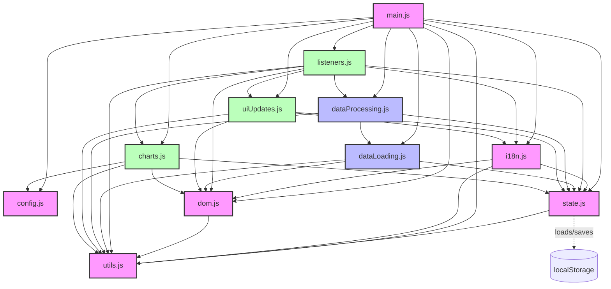

# Module Dependency Diagram

This document visualizes the dependencies between modules to help identify potential circular dependencies and understand the application structure.

## High-Level Dependency Graph



## Detailed Module Dependencies

### Core Modules
These modules have minimal dependencies and form the foundation of the application:

| Module | Depends On |
|--------|------------|
| config.js | *None* |
| utils.js | *None* |
| state.js | utils.js |
| i18n.js | state.js, dom.js, utils.js |
| dom.js | utils.js |

### Data Modules
These modules handle data loading and processing:

| Module | Depends On |
|--------|------------|
| dataLoading.js | utils.js, dom.js, state.js |
| dataProcessing.js | utils.js, state.js, dataLoading.js |

### UI Modules
These modules handle user interface and interaction:

| Module | Depends On |
|--------|------------|
| listeners.js | dom.js, utils.js, state.js, i18n.js, dataProcessing.js, uiUpdates.js, charts.js |
| uiUpdates.js | dom.js, utils.js, state.js, i18n.js |
| charts.js | config.js, dom.js, utils.js, state.js |

### Entry Point
This module initializes and orchestrates the application:

| Module | Depends On |
|--------|------------|
| main.js | All other modules |

## Potential Circular Dependencies

Based on the dependency graph, the following potential circular dependencies need to be addressed:

1. **listeners.js ↔️ uiUpdates.js**:
   - listeners.js depends on uiUpdates.js to update the UI in response to events
   - uiUpdates.js may need to register listeners for UI components

2. **listeners.js ↔️ charts.js**:
   - listeners.js sets up chart interaction handlers
   - charts.js may need to register event listeners for chart components

3. **dataProcessing.js ↔️ dataLoading.js**:
   - dataProcessing.js may trigger loading additional data
   - dataLoading.js may process loaded data

## Circular Dependency Solutions

### For listeners.js ↔️ uiUpdates.js
1. **Injection Pattern**: Pass uiUpdates functions as callbacks to listeners
   ```javascript
   // In main.js
   import * as uiUpdates from './uiUpdates.js';
   import * as listeners from './listeners.js';
   
   // Pass uiUpdates functions to listeners setup
   listeners.setupWithCallbacks({
     switchView: uiUpdates.switchView,
     updateTable: uiUpdates.renderDetailedTable,
     // etc.
   });
   ```

2. **Event Bus Pattern**: Both modules communicate through state events
   ```javascript
   // In listeners.js
   import { setState } from './state.js';
   
   function handleNavClick(viewName) {
     setState('currentView', viewName);
   }
   
   // In uiUpdates.js
   import { subscribe } from './state.js';
   
   subscribe('currentView', (viewName) => {
     // Update UI based on view change
   });
   ```

### For listeners.js ↔️ charts.js
1. **DOM Event Delegation**: Use DOM events that charts.js can listen for
   ```javascript
   // In charts.js
   document.addEventListener('chart-action', (e) => {
     const { chartId, action } = e.detail;
     // Handle chart action
   });
   
   // In listeners.js
   function triggerChartAction(chartId, action) {
     const event = new CustomEvent('chart-action', {
       detail: { chartId, action }
     });
     document.dispatchEvent(event);
   }
   ```

2. **Function Registry**: Register chart event handlers centrally
   ```javascript
   // In state.js
   const eventHandlers = {};
   
   export function registerHandler(type, handler) {
     eventHandlers[type] = handler;
   }
   
   export function triggerHandler(type, ...args) {
     if (eventHandlers[type]) eventHandlers[type](...args);
   }
   ```

### For dataProcessing.js ↔️ dataLoading.js
1. **Command Pattern**: Use a command queue for data operations
   ```javascript
   // In state.js
   const dataCommands = [];
   
   export function queueDataCommand(command) {
     dataCommands.push(command);
     processNextCommand();
   }
   
   function processNextCommand() {
     // Process commands sequentially
   }
   ```

2. **Module Split**: Separate core functionality from interdependent parts
   ```javascript
   // Create dataCore.js with shared functionality
   // Both dataLoading.js and dataProcessing.js import from dataCore.js
   ```

## Implementation Approach for Dependency Management

1. **Start with independent modules**: Implement config.js and utils.js first
2. **Build dependency chain**: Follow a bottom-up approach in this order:
   - state.js
   - dom.js
   - i18n.js
   - dataLoading.js
   - dataProcessing.js
   - uiUpdates.js
   - charts.js
   - listeners.js
   - main.js
3. **Use dependency injection** where appropriate to avoid circular dependencies
4. **Document all dependencies** at the top of each module file
5. **Watch for actual dependencies** during implementation that may differ from the plan 